# Análisis de mercado: Chocolate estilo Dubái en España

## ¿Es una tendencia real o solo un fenómeno viral?


## Índice

- [VALOR E IMPACTO LOGRADO](#VALOR-E-IMPACTO-LOGRADO)
- [VIDEO DE PRESENTACIÓN](#VIDEO-DE-PRESENTACIÓN)
- [CONTEXTO](#CONTEXTO)
- [OBJETIVO](#OBJETIVO)
- [PROCESOS](#PROCESOS)
  - [DATASET](#DATASET)
    - [MARCAS SELECCIONADAS](#MARCAS-SELECCIONADAS)
    - [TRENDS MENSUAL Y SEMANAL](#TRENDS-MENSUAL-Y-SEMANAL)
    - [PRECIOS HISTÓRICOS](#PRECIOS-HISTÓRICOS)
  - [SQL - BIGQUERY](#SQL---BIGQUERY)
  - [POWER BI DESKTOP](#POWER-BI-DESKTOP)
    - [MODELADO](#MODELADO)
    - [NORMALIZACIÓN DE DATOS](#NORMALIZACIÓN-DE-DATOS)
    - [DAX](#DAX)
  - [POWER BI SERVICE](#POWER-BI-SERVICE)
- [CONCLUSIONES](#CONCLUSIONES)
- [RECOMENDACIONES DE ESTRATEGIAS](#RECOMENDACIONES-DE-ESTRATEGIAS)
- [VISIÓN DE MEJORAS](#VISIÓN-DE-MEJORAS)
- [HERRAMIENTAS UTILIZADAS](#HERRAMIENTAS-UTILIZADAS)
- [REFERENCIAS](#REFERENCIAS)     

### VALOR E IMPACTO LOGRADO
Este proyecto arroja como resultado que cualquier marca pueda decidir en base al contenido sus próximos objetivos y tomar decisiones convincentes para entrar al mercado del chocolate “estilo Dubai”, calculando su propio margen de beneficio real teniendo un 73% promedio de sobreprecio. Además, tener en cuenta los precios a lo largo de los últimos años de productos como el cacao, pistacho y masa kataifi.
En definitiva, se aporta una herramienta que permite ver con más claridad si afrontar riesgos en base a lo que se conoce y se analizó  sobre este fenómeno.

### VIDEO DE PRESENTACIÓN
En este video explico qué problemas puede resolver este análisis, cómo se puede aplicar en un entorno real y el valor que puede aportar a una empresa.

[Ver video](LINK_ACÁ)

### CONTEXTO
El chocolate Dubai, ¿una moda o un sabor que supo imponerse en el mercado?. Como amante del chocolate, y observador de cómo se mueve el mundo,  me fui dando cuenta que cada vez este nuevo concepto estaba filtrándose en distintos productos y marcas, lo cual llevó a preguntarme si esto era una moda o algo que vino para quedarse. 
Para contextualizar un poco hay que entender que es el chocolate Dubai: es una una barra de chocolate que contiene una mezcla de masa kataifi tostada (esto le da un estilo crocante) y pasta de pistachos. Fue creado en 2021 por una chocolatería emiratí en Dubai. En el 2024 se hizo muy popular en redes sociales mostrado por influencers, especialmente en Tik Tok, desde entonces varias marcas han aprovechado a introducirlo como una línea más entre sus productos que ofrecen al mercado. 
Este proyecto trata de esto, analizar hasta dónde llega el fenómeno “estilo Dubai” y si es conveniente que las marcas sigan añadiendolo a sus producciones o por que lo hacen.

### OBJETIVO
Para poder investigar y analizar y poder tener conclusiones coherentes y ejecutables tuve que recortar y granularizar el objetivo, para poder hacerlo medible y analizable. Para esto lo que se hizo fue enfocarme en solo en barras de chocolates que lleguen al consumidor final y que tengan una versión clásica y una versión estilo Dubai. Además tienen que ser vendidas en España, y tener acceso a la información que queramos estudiar sobre dichas marcas.
El proyecto se comienza desde mucho antes que la recolección de datos, desde el pensamiento de cómo entender este fenómeno y cómo afecta al mercado, todo el trabajo se realizó desde la construcción y recolección propia utilizando fuentes que fueran de lo más fiables posible, nunca se accedió a un dataset público ni proyecto pre armado.
La pregunta de negocio que buscamos responder es: 
¿Qué elementos o factores podrían estar influyendo para que distintas marcas de productos alimenticios lancen al mercado su versión "estilo Dubai"?.

### PROCESOS

##### DATASET
Una vez que teníamos la base de lo que estábamos buscando y la pregunta de negocio a responder, llegamos al punto de que datos íbamos a reunir para esta investigación. Para desarrollar esto y llevarlo adelante lo dividimos en tres capas o tres grupos.

**Nota sobre fuentes de datos:**

Las fuentes utilizadas para la construcción de los datasets se encuentran detalladas dentro de cada archivo en la carpeta `/data`, donde se incluye una columna específica de referencia para cada registro.


###### 1- MARCAS SELECCIONADAS

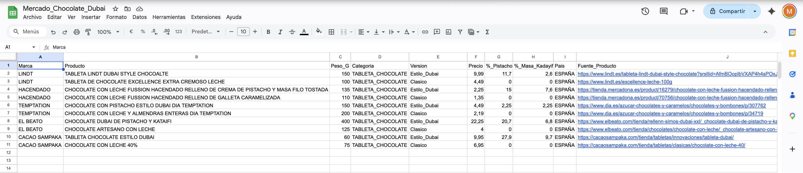

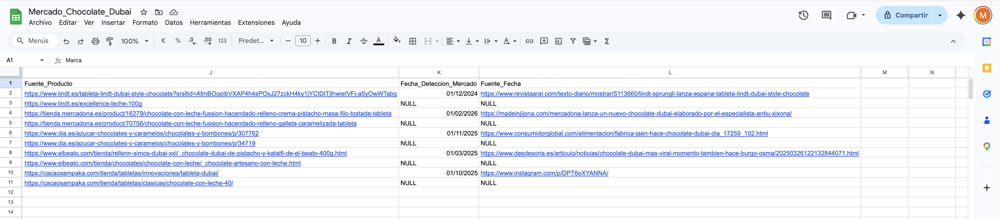

En este dataset lo que se hizo fue reunir 5 marcas de distintos sitios elegidos al azar. Se investigó por internet, y los requisitos que teníamos eran que sean barras de chocolates en forma de tableta, que tengan una versión clásica y otra versión Dubai, que sean de fácil acceso al consumidor final, ya sea en grandes cadenas de supermercados o por internet, que tengan precio de venta al público visible y de fácil acceso, que se puedan leer sus ingredientes y las proporciones, que conforman dicho producto, fácilmente. Además se varió en la selección eligiendo dos marcas artesanales para enriquecer el conjunto de datos. 


CRITERIOS Y PASOS A TENER EN CUENTA

- Lindt tiene fecha de lanzamiento en diciembre 2024 pero se reelanzo el mismo producto junto a mas versiones (chocoalte negro y chocoalte blanco) en febrero 2026
- En todas las marcas las versiones que utilice como clásica se trato de elegir una versión que tenga la similitud más próxima a la versión dubai en cuanto a misma marca y mismo packaging, dentro de estos parámetros opte por la versión más clásica de todas las posibles y que sea de leche esta versión clásica.
- Hacendado tiene un lanzamiento en mayo 2025, pero es otra version de chocolate blanco que la descontinuaron o la relanzaron cambiando el fabricante y salió en febrero del 2026, tomo esta fecha como aproximación de detección de mercado ya que es el producto que hace referencia en mi dataset.
- Hacendado no tiene una versión clásica de tableta de chocolate de leche en su marca Fussion. Para solucionar esto tomamos una versión de chocolate con leche relleno de galleta caramelizada, que formaba parte de los precios más bajos en la marca Fussion y tenía galleta caramelizada, un producto a destacar y bueno para comparar con una versión estilo Dubai.
- Temptation no tiene clara ni próxima una fecha de lanzamiento y no hay aviso en ningún portal de internet como diario o revista ni tampoco de la marca de supermercados DIa, por lo tanto tome como fecha de avistaje en el mercado una nota que hacer referencia a un video de Tik tok publicado por la cuenta de Dia España donde visitan la fábrica donde se hacen los chocolates versión estilo Dubai de la marca Temptation que comercializa Dia. Es por esto que la fecha es en noviembre del 2025, la fecha más fiable que se conoce como aproximación a su lanzamiento, un avistaje.
- En cuanto al porcentaje de sus ingredientes posee pasta de pistacho con un  27% sobre el 50% que comprende el relleno sobre el total de la tableta de chocolate pero no fue tenido en cuenta porque no decía cuánto de esa pasta era de pistacho puro, solo tuve en cuenta la medida de pistacho tostado troceado de 4,5% sobre el 50% que comprende el relleno del total de la tableta de chocolate.
- Como dije antes en su versión clásica fue tomada una que tenía en cuenta las mismas condiciones de chocolate de leche, marca y packaging, por eso se toma en cuenta una versión con almendras enteras, ya que su versión clásica de leche no tenía un envoltorio con las mismas cualidades que su estilo Dubai. Con esto intente asemejarnos y también aprovechar a comparar el fenómeno Dubai con una versión que poseía un fruto seco entero lo que lo hace que tampoco sea nada clásico y tenga un alto calibre, y ver el comportamiento de su comparativa entre los dos chocolates con estos frutos secos correspondiente a cada uno.
- El Beato es una marca artesanal, para su versión clásica tome el chocolate con leche más puro, en sentido de sus componentes, posible y obviamente que sea de chocolate con leche.
- En el caso de Cacao Sampaka, su envase no se parece a nada en la versión Dubai a la clásica de chocolate con leche,pero al tratarse de una marca artesanal lo tome como válido, pocos productos y con una versión y tratado especial para cada uno tiene o pareciera mostrar. En el caso de la versión dubai asimila una bolsa que posee el chocolate por dentro y la versión clásica es una caja rectangular como las versiones más normales de una tableta de chocolate en todas las marcas en general. Esto puede alterar el precio pero sabemos que es un factor de marca artesanal, lo cual tener en el dataset marcas artesanales aumentaría mucho más su riqueza en valor de datos.
- Una vez obtuvimos nuestro conjunto de datos, lo sometimos a un proceso de limpieza donde se utilizó Python por medio de Google Colab, donde, se eliminaron y agregaron otras columnas, se editaron formatos, todo esto para un correcto análisis y lectura posterior de SQL en Bigquery.

Bloques de código utilizado: 
```python
# Limpieza y transformación clave
df['Precio'] = df['Precio'].astype(str).str.replace(',', '.').astype(float)
df.columns = df.columns.str.lower()
df['fecha_deteccion_mercado'] = pd.to_datetime(df['fecha_deteccion_mercado'], dayfirst=True, errors='coerce')

# Nueva métrica
df['precio_100g'] = (df['precio'] / df['peso_g']) * 100
```

[Ver notebook completo](notebooks/Mercado_Chocolate_Dubai.ipynb)

Archivo final tipo .CSV:

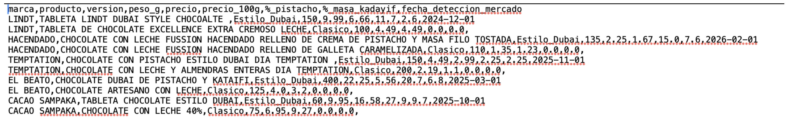

###### 2- TRENDS MENSUAL Y SEMANAL
La segunda capa de datos que se reunió fue la tendencia que tenía el “chocolate Dubai” por medio de Google Trends. Para esto se intentó capturar la fuerza de tendencia por medio de un script de Python en Google Colab con tres variables claves: chocolate Dubai, pistacho y masa kataifi. A cada variable se le adjunto un conjunto de palabras claves que se relacionaban con cada una de ellas. Con esto lo que se buscaba era ver la fuerza de tendencia por cada grupo a través del tiempo y encontrar patrones o relaciones con los lanzamientos de cada marca de su versión Dubai.
Se realizaron dos conjuntos de datos iguales pero con una pequeña variación, conjunto de datos agrupado por fecha semanal y conjunto de datos agrupados por fecha mensual. El primero es porque este nos permite ver más en detalle cómo varía la tendencia a través del tiempo nos permite construir gráficos con una granularidad más exquisita, el segundo porque necesitábamos también unirlos y entrelazarlos con las demás capas de datos y todos poseían o estaban agrupados en fecha mensual permitiendo asi un facil entendimiento entre ellos.
Ambos conjuntos de datos se guardaron en un archivo tipo .CSV que se utilizó para un posterior análisis.
Aquí no hay proceso de limpieza ya que los datos se solicitan como se necesitan.

Bloques de código utilizados:
```python
conceptos = {
    "trend_chocolate_dubai": "Chocolate Dubai + Chocolate de Dubai + Dubai Chocolate + Tableta Dubai",
    "trend_pistacho": "Pistacho + Crema de pistacho + Crema pistacho + Pasta de pistacho",
    "trend_kataifi": "Kataifi + Katayfi + Kadayif + Kadaif + Fideos turcos"
}

for nombre_columna, query in conceptos.items():
    pytrends.build_payload([query], timeframe='2024-01-01 2026-03-23', geo='ES')
    df = pytrends.interest_over_time()
```

[Ver notebook completo](notebooks/trends_chcolate_dubai_semanal_mensaul.ipynb)

Vista previa de los archivos tipo .CSV generados:

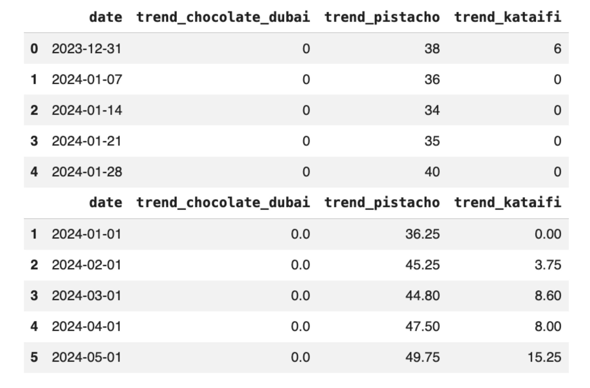

###### 3- PRECIOS HISTÓRICOS
Este dataset fue creado para reunir los precios históricos de nuestras tres variables importantes: chocolate Dubai, pistacho y masa kataifi. Lo que buscamos aquí es ver como evolucionó en el tiempo los precios que afectan directamente a la tableta de chocolate “estilo Dubai” y si puede haber una inferencia con los datos que ya obtuvimos en las capas anteriores, fechas de lanzamiento y fuerzas de tendencia. Los precios de los productos que buscamos fueron: cacao, pistacho, masa kataifi.

Vista parcial del dataset:

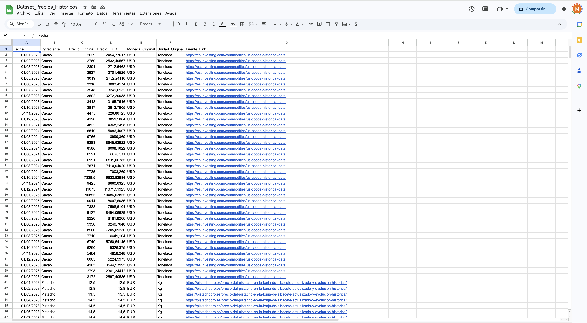

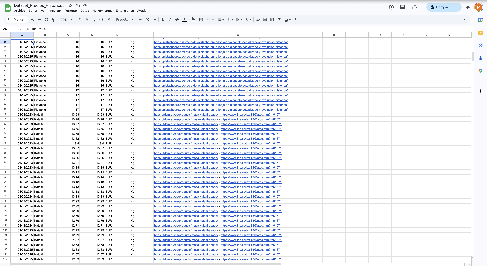

CRITERIOS y PASOS A TENER EN CUENTA

- Se buscaron precios históricos de cacao, pistacho y masa kataifi dentro del periodo 01/01/2023 al 03/03/2026. 
- Para el cacao se utilizó investing.com, para el pistacho La Lonja de Albacete y en el caso de kataifi no hay una evolución de precio por lo cual se utilizó otro procedimiento de medición y recolección. Este último consistió en buscar el precio de masa tostada (el chocolate estilo Dubai lleva masa kataifi tostada, para calcular el precio de referencia me base en que las marcas ya la compran tostadas, para seguir un camino de mi investigación), en fdcm.eu y para obtener los precios historicos busque en el Instituto Nacional de Estadísticas (INE) el índice de Índices de Precios Industriales. IPRI+IPRIX. Base 2021 para (1073) Fabricación de pastas alimenticias, cuscús y productos similares. Al tener el valor de índice necesario para cada mes, aplique la fórmula necesaria: precio mes x= (índice mes x*12,60)/119,336 con esta fórmula logre retroceder en el tiempo y obtener el precio de cada, ya que el valor que yo tenía era el de la página web de fdcm.eu y era equivalente a la última fecha del periodo.

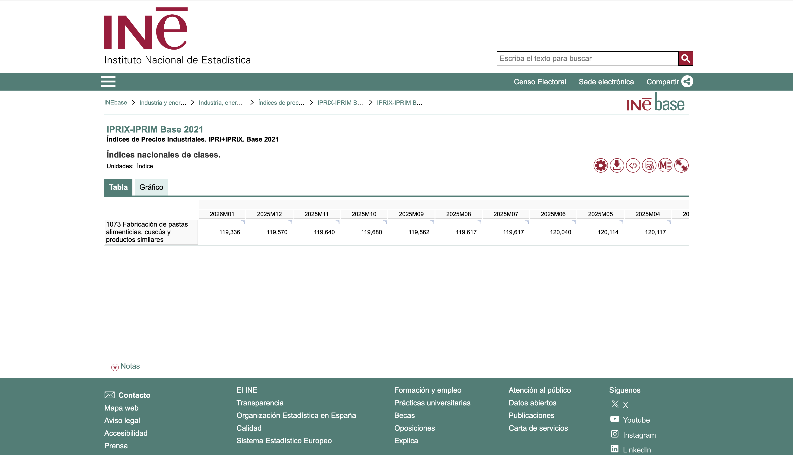

- Luego de obtener los datos, aprovechando que estoy en Google Sheets, cree una columna nueva y utilizando la formula de GoogleFinance =SI(E2="USD"; C2 * INDICE(GOOGLEFINANCE("CURRENCY:USDEUR"; "price"; A2); 2; 2); C2) logre calcular todos los precios a valor Euro. Con esto realice un trabajo previo de ETL sobre Google Sheets. 
- Para terminar, descargue el archivo como tipo .CSV y lo subí a un nuevo libro de trabajo en Google Colab donde por medio de Python se hizo un trabajo de ETL completo: cambiar comas por puntos en los precios, cambiar todas las medidas de peso a Kg, cambiar el formato de la fecha para que se entienda de manera correcta con SQL en Bigquery, eliminar la mayúscula en cada columna de cabecera para que se entienda de manera correcta con SQL en Bigquery, crear una nueva columna donde los precios sean por Kg y en Euro y por último eliminar las columnas innecesaria. Se cerró el trabajo descargando el archivo limpio como tipo .CSV para usar junto a los demás dataset en el análisis.

Bloques de código utilizados:
```python
def transformar_datos(row):
    precio = float(str(row['Precio_EUR']).replace(',', '.'))
    ingrediente = str(row['Ingrediente']).lower()

    if 'cacao' in ingrediente:
        return precio / 1000
    else:
        return precio

df['precio_eur_kg'] = df.apply(transformar_datos, axis=1)
df['fecha'] = pd.to_datetime(df['Fecha'], dayfirst=True).dt.strftime('%Y-%m-01')

df_final = df[['fecha', 'Ingrediente', 'precio_eur_kg']]
df_final.to_csv('Dataset_Precios_Historicos_Limpio.csv', index=False)
```

[Ver notebook completo](notebooks/Dataset_Precios_Historicos.ipynb)

Vista parcial del dataset final, limpio para su posterior análisis:

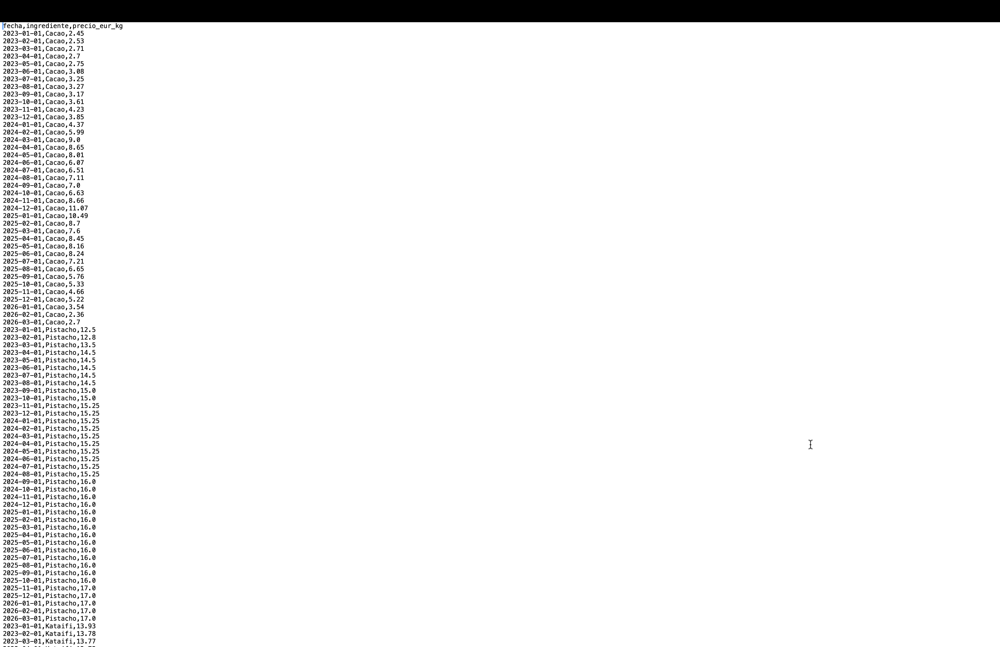

#### SQL - BIGQUERY
Luego de tener los 4 archivos limpios para utilizar (capa 1: Mercado_Chocolate_Dubai_Limpio.csv, capa 2: trends_chocolate_dubai_semanal.csv y trends_chocolate_dubai_mensual.csv, capa 3: Dataset_Precios_Historicos_Limpio.csv) lo que se hizo pasar por segundo proceso de ETL donde se refinaron temas de limpieza y uniones.

Empezamos creando el proyecto denominado “analisis-chocolate-dubai”, donde creamos el conjunto de datos denominado “chocolate-dubai” y dentro de él creamos 3 tablas, denominadas “dataset-precios-historicos”, “mercado-chocolate-dubai” y “trends-chocolate-dubai-mensual”.

Cada una de estas tablas lleva el mismo nombre que el dataset que contiene dentro el cual subimos nosotros como archivo tipo .CSV. Dejamos fuera de SQL el archivo de trends semanal, ya que este no lo utilizamos por ahora.

Capturas de pantalla de cada tabla mostrando su esquema y vista previa:

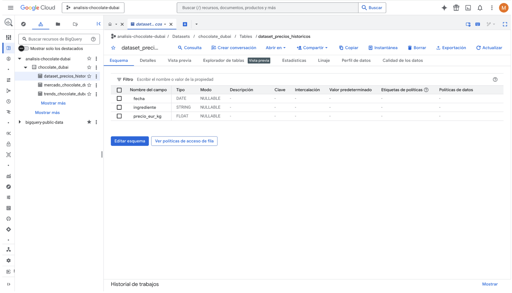

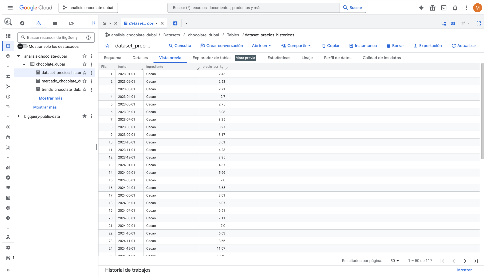

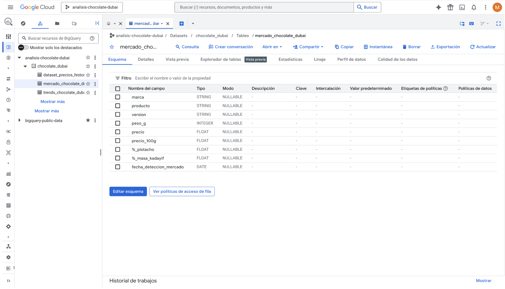

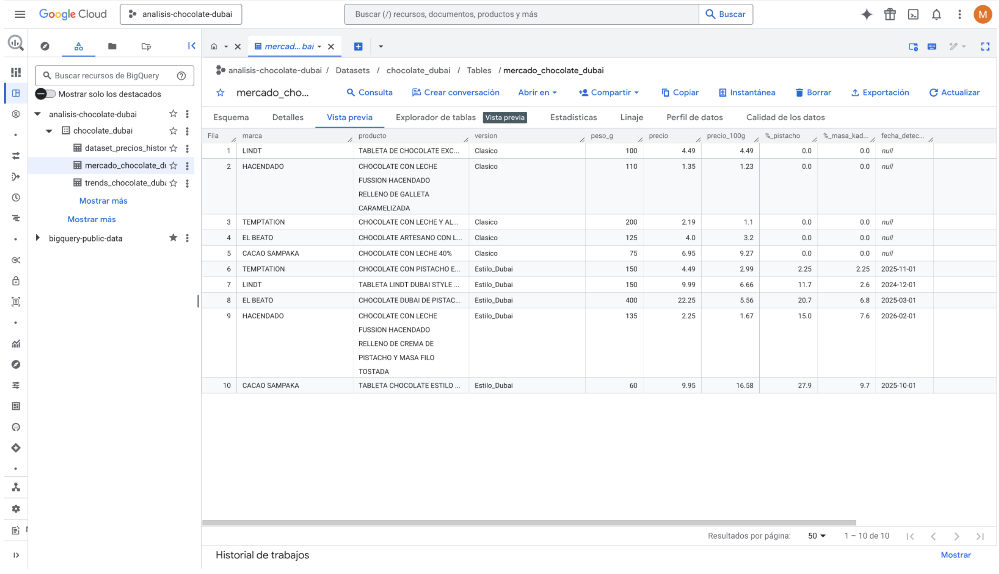

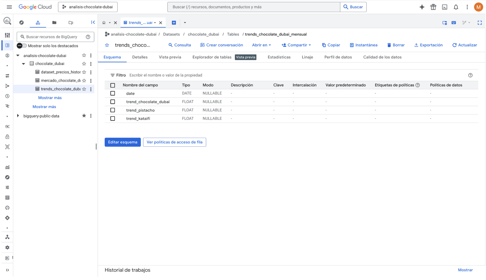

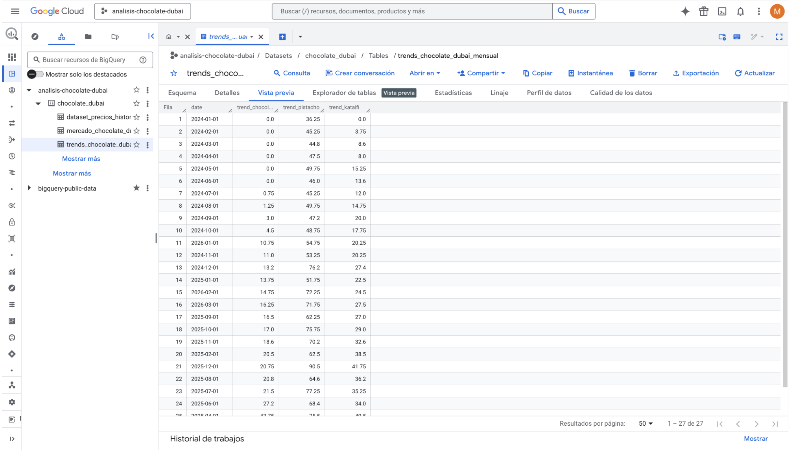

El trabajo de consulta que realizamos en SQL Bigquery:

- Se creó un calendario mensual completo para garantizar una serie temporal continua.
- Se transformaron los precios históricos mediante un proceso de pivot para obtener los costos por ingrediente.
- Se limpiaron y renombraron las variables de Google Trends para mantener consistencia en los datos.
- Se integraron todas las fuentes mediante JOIN utilizando la fecha como clave principal.
- Se filtraron los productos de versión clásica sin fecha para evitar distorsiones en el análisis.

Lo que se busco fue crear una sola tabla con todos los tres dataset subidos a nuestro proyecto SQL en Bigquery, por esto fue que creamos el archivo de trends en formato mensual, ya que se podía integrar bien con los demás datos en el mismo formato, por esta razón nuestro dataset de trends semanales aun no lo usamos ni lo integramos en SQL.

Consulta realizada:
```sql
WITH calendario AS (
 SELECT date
 FROM UNNEST(GENERATE_DATE_ARRAY('2023-01-01', '2026-03-01', INTERVAL 1 MONTH)) AS date
),
precios_pivot AS (
 SELECT
   fecha,
   MAX(CASE WHEN ingrediente = 'Cacao' THEN precio_eur_kg END) AS costo_cacao_kg,
   MAX(CASE WHEN ingrediente = 'Pistacho' THEN precio_eur_kg END) AS costo_pistacho_kg,
   MAX(CASE WHEN ingrediente = 'Kataifi' THEN precio_eur_kg END) AS costo_kataifi_kg
 FROM `analisis-chocolate-dubai.chocolate_dubai.dataset_precios_historicos`
 GROUP BY fecha
)
SELECT *
FROM calendario c
LEFT JOIN precios_pivot p ON c.date = p.fecha
ORDER BY c.date;
```

[Ver consulta completa](sql/tabla-final.sql)

Se ejecuto la consulta SQL:

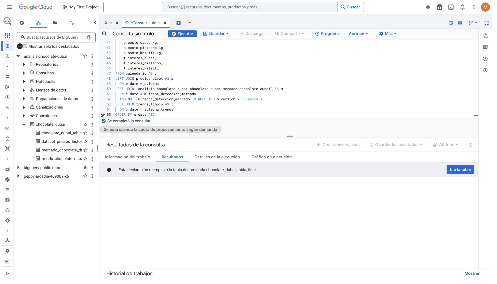

Capturas de pantalla de la tabla final denominada “chocolate-dubai-tabla-final” creada a partir de la consulta SQL ejecutada, donde se muestra el esquema y vista previa:

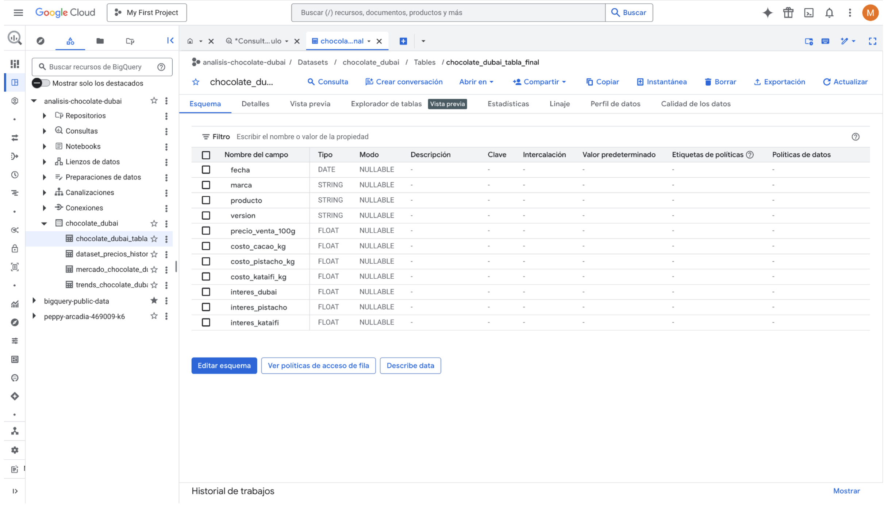

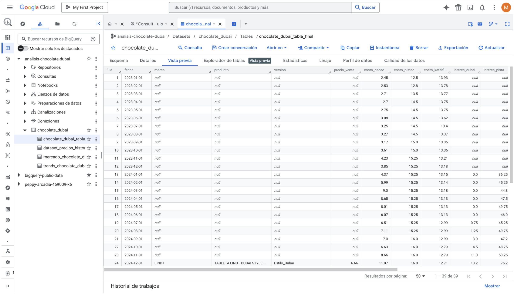


#### POWER BI DESKTOP

La tarea siguiente fue crear un archivo de Power BI Desktop llamado “analisis_chocolate_dubai” en el cual vamos a trabajar para hacer nuestro análisis y poder sacar las conclusiones que nos muestran los datos.
Lo primero es cargar los archivos que vamos a utilizar. Empezamos conectándonos a Bigquery para cargar nuestra tabla resultante de la unión mostrada anteriormente.

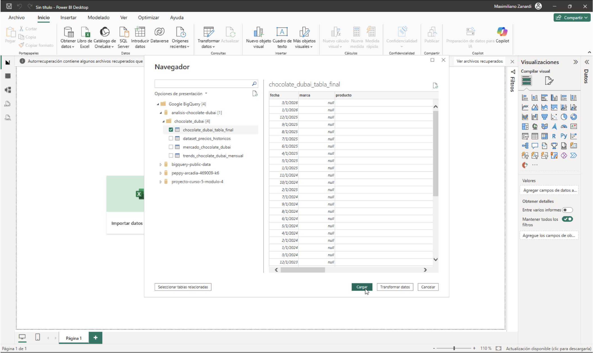

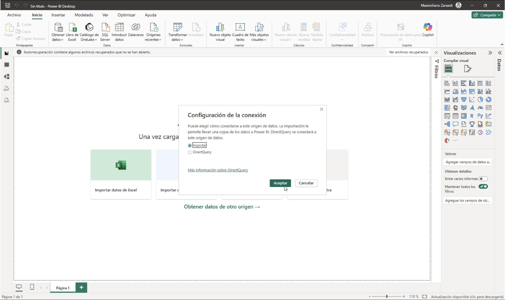

Luego, vamos a cargar dos archivos más, nuestro trends semanal y el archivo creado en la capa uno donde recolectamos las cinco marcas de tabletas de chocolate.

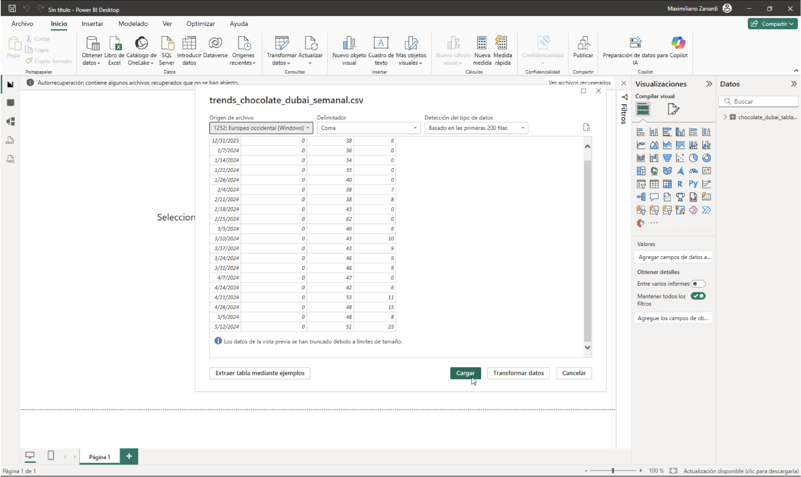

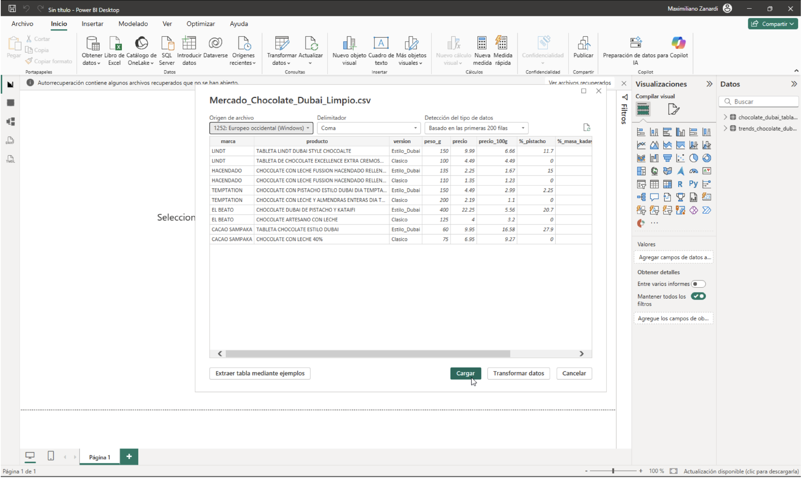

El archivo semanal, como hemos explicado anteriormente, lo necesitamos ya que muestra la fuerza de tendencia de una manera más detallada y con mayor granularidad que el archivo en formato mensual. El archivo denominado “Mercadp_Chocolate_Dubai_Limpio” lo necesitamos nuevamente ya que como sabemos contiene las 5 marcas de tabletas de chocolate Dubai que están en el archivo SQL, pero también contiene la comparativa de su misma marca pero una versión de tableta clásica. Estas quedaron fuera de la tabla final hecha en SQL ya que por un tema de estructura se eligió no subirlas al no poseer una fecha de referencia, en cambio, se optó por subirlas como otra tabla a Power BI Desktop.

##### MODELADO

Se hizo un trabajo de relación de tablas para conectarlas formando un modelo estrella. Antes de ir a administrar relaciones, se utilizó una fórmula DAX para crear una tabla de calendario.
Fórmula DAX: Calendario = CALENDAR(MIN('chocolate_dubai_tabla_final'[fecha]), MAX('chocolate_dubai_tabla_final'[fecha]))

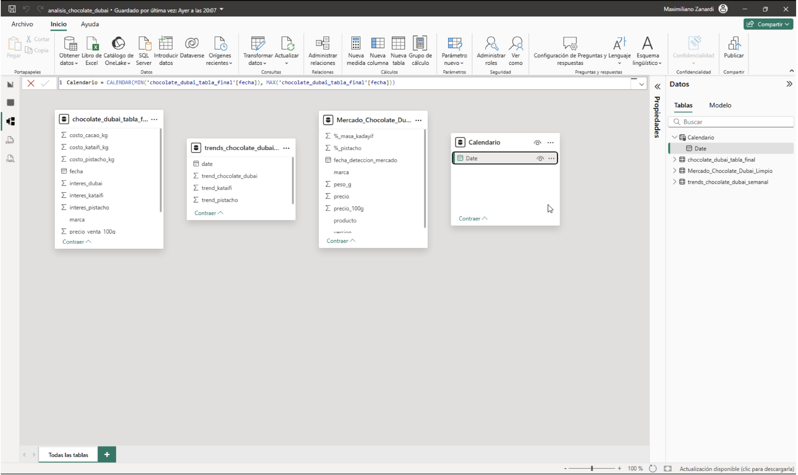

Administración de relaciones:

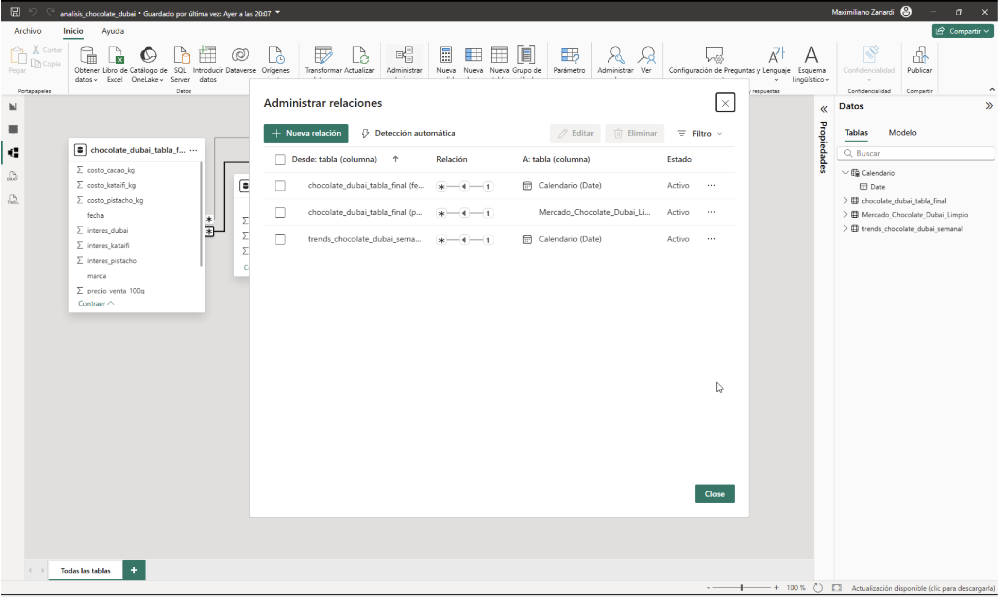

Mapa de modelado ya realizado:

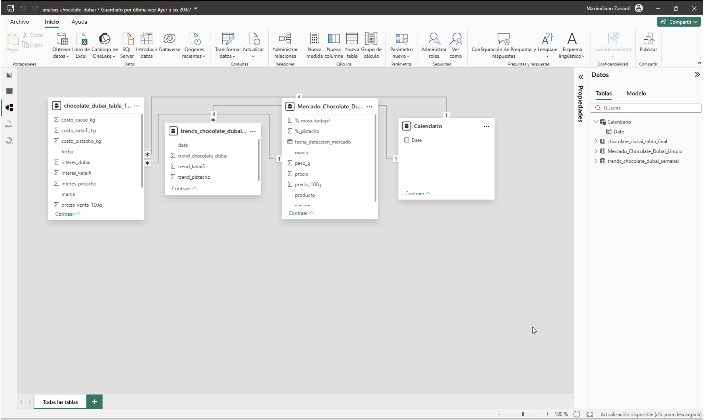

Como podemos ver se creó un esquema de constelación (Galaxia), donde varias tablas de hecho comparten una única tabla de dimensiones.
Las tablas de hechos son: chocolate_dubai_tabla_final, Mercado_Chocolate_Dubai_Limpio y trends_chocolate_dubai_semanal.
La tabla de dimensión es: Calendario.
Este tipo de esquema (constelación o galaxia) se da al tener más de una tabla de hechos. 

##### NORMALIZACIÓN DE DATOS
Se estandarizaron las columnas de fecha (DD/MM/AAAA) y moneda (€) para asegurar la legibilidad del reporte y la consistencia entre fuentes de datos (BigQuery, CSV y Google Trends).
Se trabajó en las mejoras de calidad de los tipos de datos ajustando los mismos (Enteros para índices, Decimales para pesos y porcentajes), para optimizar el rendimiento del motor de Power BI y evitar errores de redondeo en los cálculos.
Se adjunta capturas de pantalla de solo una tabla como muestra del resultado.

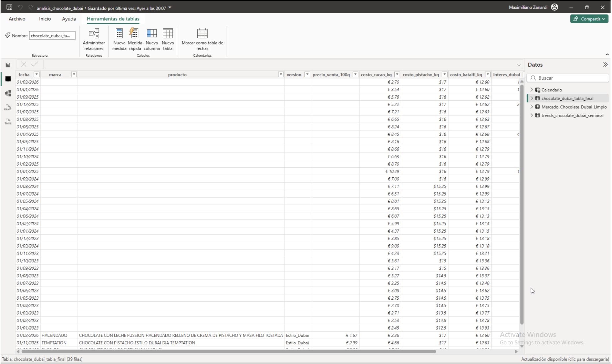

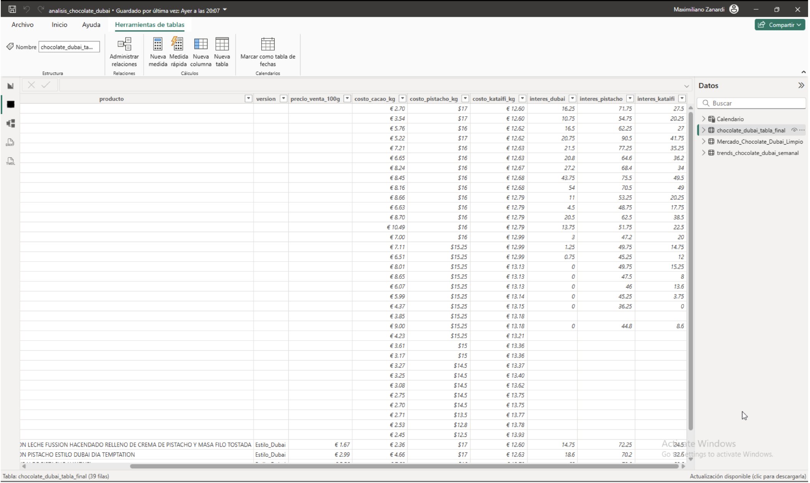

##### DAX

En esta sección procedemos a mostrar todas las fórmulas dax utilizadas a lo largo de nuestro análisis.

1- Necesitamos crear una columna en la tabla Calendario que nos permita crear un gráfico con un eje x de fechas semanales continuo. Para ello creamos dos columnas calculadas (DAX):

AñoSemana = 
YEAR('Calendario'[Date]) * 100 + WEEKNUM('Calendario'[Date], 2)

Esto crea un identificador semanal numérico.

Fecha_Eje = 
VAR _Anio = INT( [AñoSemana] / 100 )
VAR _Semana = MOD( [AñoSemana], 100 )
RETURN
DATE( _Anio, 1, 1 ) + ( _Semana - 1 ) * 7 - WEEKDAY( DATE( _Anio, 1, 1 ), 2 ) + 1

Con esta segunda columna logramos transformar ese identificador en una fecha real para usarla como eje continuo

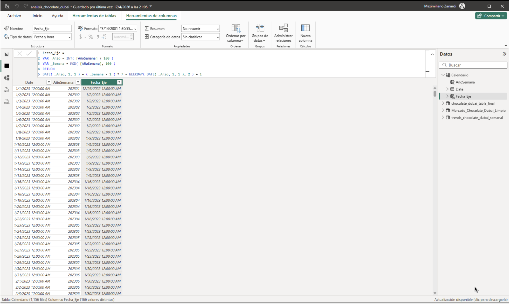

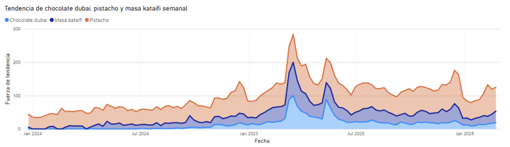

2- Las siguientes fórmulas son medidas DAX que utilizamos para crear variaciones porcentuales semanales, tanto para Chocolate Dubai, Pistacho y Masa kataifi.

Chocolate:
- Var_%_Choc_Semanal = DIVIDE([Valor_Ultima_Semana_Choc] - [Valor_Semana_Anterior_Choc], [Valor_Semana_Anterior_Choc], 0)
- Valor_Ultima_Semana_Choc = CALCULATE(SUM(trends_chocolate_dubai_semanal[trend_chocolate_dubai]),LASTDATE('Calendario'[Fecha_Eje]))
- Valor_Semana_Anterior_Choc = CALCULATE( [Valor_Ultima_Semana_Choc], DATEADD('Calendario'[Fecha_Eje], -7, DAY), ALL('Calendario'))

Pistacho:
- Var_%_Pist_Semanal = DIVIDE([Valor_Ultima_Semana_Pist] - [Valor_Semana_Anterior_Pist], [Valor_Semana_Anterior_Pist], 0)
- Valor_Ultima_Semana_Pist = 
- CALCULATE(SUM(trends_chocolate_dubai_semanal[trend_pistacho]), LASTDATE('Calendario'[Fecha_Eje]))
Valor_Semana_Anterior_Pist = CALCULATE([Valor_Ultima_Semana_Pist], DATEADD('Calendario'[Fecha_Eje], -7, DAY), ALL('Calendario'))

Masa kataifi:
- Var_%_Katai_Semanal = DIVIDE([Valor_Ultima_Semana_Katai] - [Valor_Semana_Anterior_Katai], [Valor_Semana_Anterior_Katai], 0)
- Valor_Ultima_Semana_Katai = CALCULATE(SUM(trends_chocolate_dubai_semanal[trend_kataifi]), LASTDATE('Calendario'[Fecha_Eje]))
- Valor_Semana_Anterior_Katai = CALCULATE([Valor_Ultima_Semana_Katai], DATEADD('Calendario'[Fecha_Eje], -7, DAY), ALL('Calendario'))

Resultado:

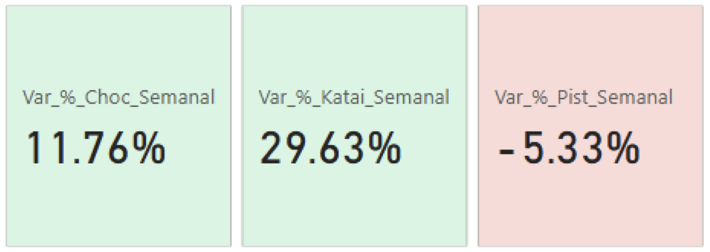

Por medio de un slicer podemos deslizarnos a la semana que queramos observar y ver la variación porcentual con respecto a la semana anterior.

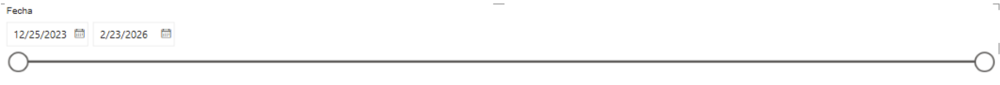

3- La última medida DAX creada fue para mostrar si había un sobreprecio de los productos versión estilo Dubai sobre los productos versión clásica de la misma marca asociado al hype.

Sobreprecio_Hype_% = 
VAR _PrecioDubai = 
    CALCULATE(
        AVERAGE('Mercado_Chocolate_Dubai_Limpio'[precio_100g]), 
        'Mercado_Chocolate_Dubai_Limpio'[version] = "Estilo_Dubai"
    )
VAR _PrecioClasico = 
    CALCULATE(
        AVERAGE('Mercado_Chocolate_Dubai_Limpio'[precio_100g]), 
        'Mercado_Chocolate_Dubai_Limpio'[version] = "Clasico"
    )
RETURN
DIVIDE(_PrecioDubai - _PrecioClasico, _PrecioClasico)

La usamos en dos visualizaciones, la primera en una tarjeta que calcula el promedio general de las cinco marcas y la segunda, en una tabla con el sobreprecio calculado para cada marca.

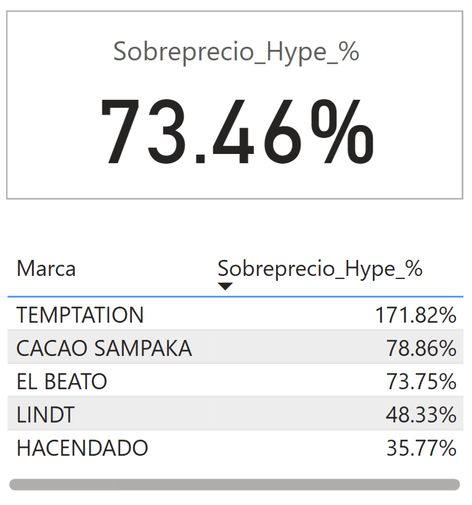

#### POWER BI SERVICE

A continuación mostraremos todas las páginas del informe el cual fue hecho en Power BI Desktop y compartido en Power BI Service.

1- Resumen ejecutivo: es la primera página y detalla un resumen de los visuales más importante del informe.

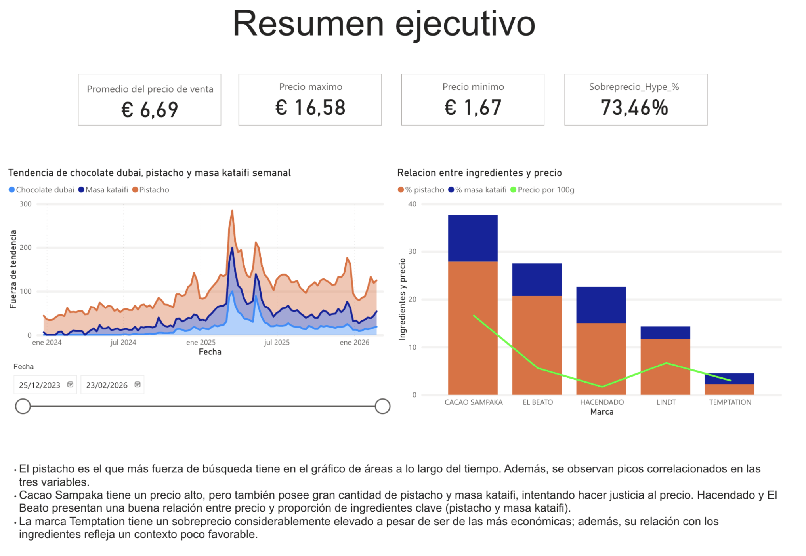

2- Producto: se presentan los productos estilo Dubai tratados y sus puntos importantes.

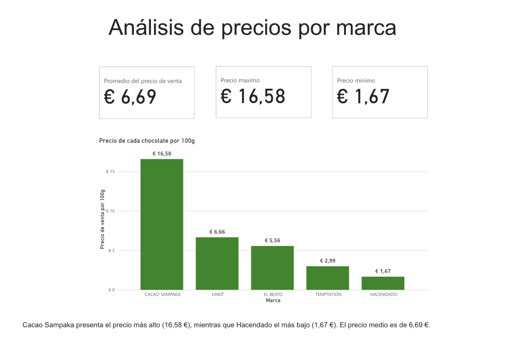

3- Tendencias mensuales: muestra la fuerza de tendencia a lo largo del tiempo en una escala mensual.

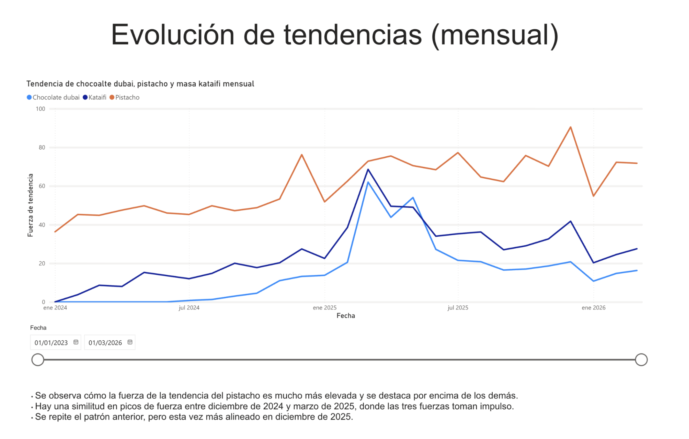

4- Tendencias semanales: fuerza de tendencia semanal, que entrega un mayor detalle que la página anterior y además se puede hacer un recorrido más detallado con más información sobre las tendencias de las tres variables.

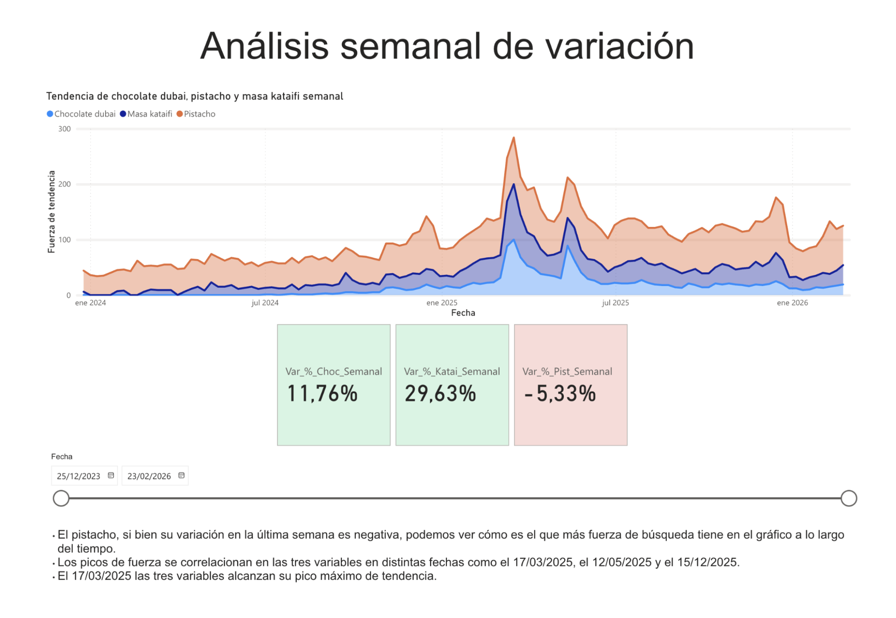

5- Costo: esta página muestra insight claves sobre todo el análisis hecho. Está relacionada con el costo de los productos y precios históricos de ingredientes importantes para la tableta de chocolate estilo Dubai. 

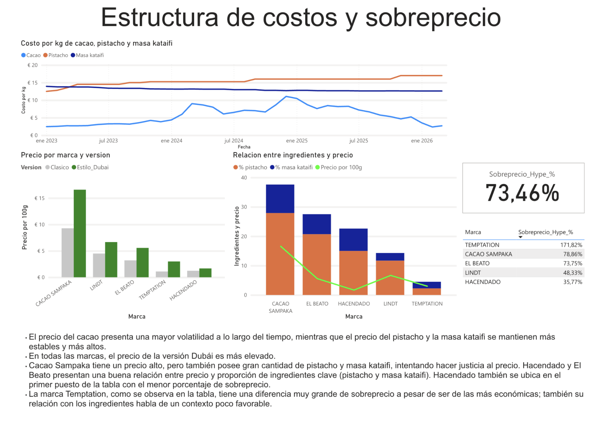

6- Forecast: Se muestra una proyección hasta finales del 2026 de cómo evoluciona la fuerza de tendencia de nuestras tres variables. La escala de tiempo usada es semanal.

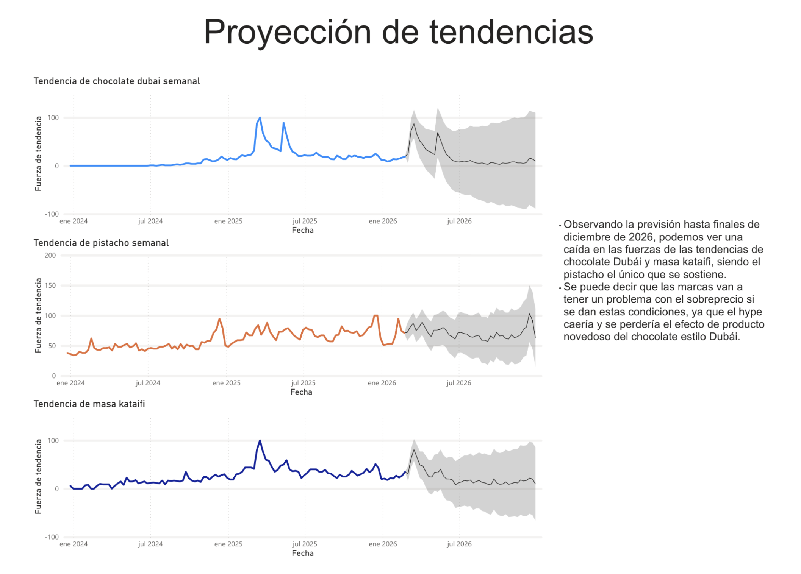

VISTA MÓVIL

Por último, se presenta la vista móvil preparada para la primera página “Resumen ejecutivo”.

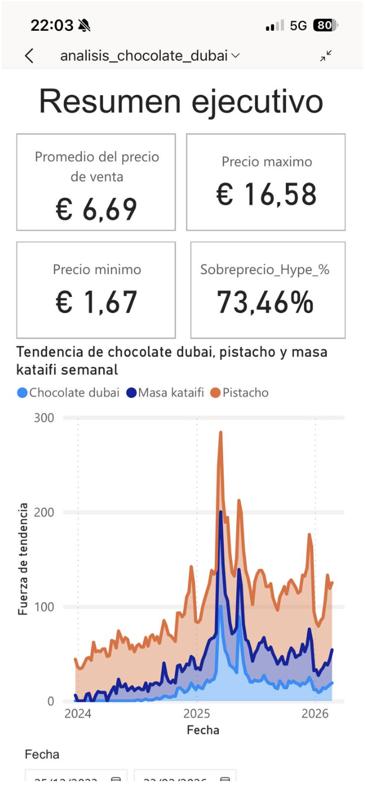

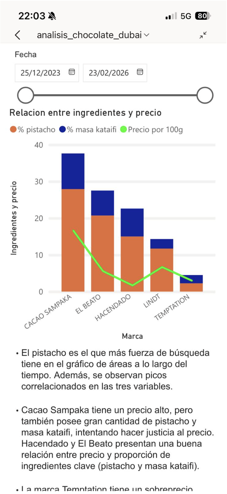

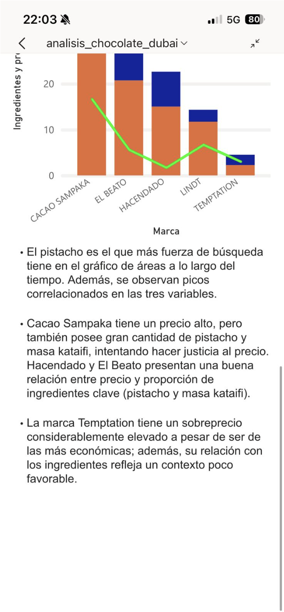

Se recomienda visualizar el video para ver el informe en funcionamiento en Power BI Service, incluyendo la versión completa y la vista móvil.

[Ver video](LINK_ACÁ)

### CONCLUSIONES

Luego de haber recorrido todo el proyecto es momento de detallar una serie de conclusiones que se pudieron obtener a partir del análisis realizado. 

- Las fechas de lanzamientos que van desde diciembre del 2024 hasta febrero del 2026 coinciden con los picos más altos de fuerza de tendencia, tal como podemos ver en el gráfico de tendencia semanal. Esto podría estar respondiendo porque las marcas se suben a estas tendencias.
- Podemos ver como el color verde predomina en el packaging y en su interior. Según la información de la marca pionera, FIX Dessert Chocolatier, el uso del color verde en su identidad visual responde a una estrategia de codificación de sabor, vinculando directamente el empaque con el ingrediente premium del producto: la crema de pistacho. Esta elección no solo facilita la identificación del sabor, sino que refuerza la percepción de exclusividad al asociarse con un fruto seco de alto valor en la repostería artesanal.
Esto también se refuerza siendo que el pistacho tiene un precio más elevado en comparación del resto de los ingredientes y también una fuerza de búsqueda mucho mayor.
- En cuanto a los costos se observa que las marcas artesanales que forman parte del proyecto (Cacao Sampaka y El Beato) tienen un precio elevado pero respetan una relación favorable en cuanto a los porcentajes de ingredientes importantes que contienen. Si hablamos de Lindt es una marca que su precio no está respaldado por sus ingredientes y su propio nombre tiene peso sobre el precio. Por último, las dos marcas restantes, vemos que Hacendado es un producto muy noble en relación a calidad-precio y existe la contracara que es Temptation, presenta un precio bajo acompañado de un porcentaje bajo de ingredientes claves lo que hace que se vea afectado en nuestra comparativa. 
Cabe aclarar que los valores de esta última marca fueron tomados bajo este criterio: “En cuanto al porcentaje de sus ingredientes posee pasta de pistacho con un  27% sobre el 50% que comprende el relleno sobre el total de la tableta de chocolate pero no fue tenido en cuenta porque no decía cuánto de esa pasta era de pistacho puro, solo tuve en cuenta la medida de pistacho tostado troceado de 4,5% sobre el 50% que comprende el relleno del total de la tableta de chocolate.” que mencionamos al principio de este trabajo. Esto pone en tela de juicio lo dicho por falta de aclaración o explicación en la distribución de sus ingredientes. 
- El sobreprecio explica la diferencia que hay entre la versión clásica y el estilo dubai de la misma marca. El promedio de las cinco marcas es de 73,46%. Hacendado, fiel a lo que viene mostrando, tiene la diferencia más baja, cabe recordar como aclaramos antes, que su comparativa fue con un chocolate de la misma marca Hacendado Fussion, el cual era relleno de galleta caramelizada. Esto puede explicar que la brecha sea más corta entre los precios.
Pero a su vez Temptation fue comparado con una versión clásica que contenía almendras enteras lo cual rompió la sintonía de un producto modesto. Aun así vemos como posee un diferencia de precio ( o sobreprecio) en su versión dubai de 171,82%.
Esta sección de costos y sobreprecio deja muchos indicios de un hype creado a partir de la  versión estilo Dubai, lo cual podría producir pagar el precio más elevado que otras versiones.  También me animo a poner esta duda sobre la mesa ya que como dice su marca fundadora de este boom que sacudió el mercado todo esto tuvo una fuerte viralización por redes sociales, haciendo que se conozca por todas partes.
- Por último, cabe recordar que si observamos la pestaña de Forecast, vemos cómo se proyecta que para finales del 2026  se pierde mucha fuerza de tendencia, en nuestras variables siendo el pistacho el único que se podría sostener entre las variables analizadas.

Volviendo al inicio del proyecto y citando nuevamente la pregunta de negocio, ¿Qué elementos o factores podrían estar influyendo para que distintas marcas de productos alimenticios lancen al mercado su versión "estilo Dubai"?, estamos en condiciones de responder que hay un hype alto con respecto al “estilo Dubai” que las personas lo sienten deseado, ya que, al hablar de Dubai, estamos hablando de lujo y extravagancia, esto es marketing puro, algo que también se volvió viral en redes sociales rápidamente y hizo que esta versión de chocolate se ubicar en estándares de exclusividad.
Podemos concluir que las marcas de chocolates y demás productos dulces al ver esta ola se subieron al fenómeno y poder así obtener su tajada del mercado.
Cabe recalcar que durante la investigación se observaron distintos productos, los cuales no eran tabletas de chocolates, pero si lanzaron al mercado su versión Dubai. Al observar sus ingredientes nos damos cuenta que se alejan de la receta original, pero de todas formas logran posicionarse y tener una porción del mercado gracias a lo que genera en el consumidor elegir lo que todo el mundo consume en estos momentos, versión “estilo Dubai”.

### RECOMENDACIONES DE ESTRATEGIAS
- Monitoreo de Variables Críticas: Mantener un seguimiento constante entre la volatilidad de los precios de materias primas (cacao, pistacho y masa kataifi) y la fuerza de la tendencia en búsquedas para anticipar caídas de interés.
- Blindaje de Calidad: Priorizar la excelencia del producto final. En un mercado de sobreprecio, la calidad es lo único que justifica la fidelidad del cliente una vez que el fenómeno viral disminuye.
- Viralidad Estratégica: Apalancarse en la narrativa de redes sociales que originó el fenómeno, utilizando el mismo lenguaje visual y rapidez de respuesta que los creadores de contenido.
- Gestión de la Incertidumbre de Mercado: Dado que no se puede predecir la duración exacta de la tendencia, se recomienda una gestión de recursos flexible. El objetivo es mantener una estructura de producción que permita escalar si la demanda se mantiene o pivotar rápidamente si el mercado satura, evitando comprometer la operatividad total en una sola apuesta.


### VISIÓN DE MEJORAS
Al concluir el proyecto me gustaría agregar un auto feedback o visión de mejoras. Mi intención no es cambiar el proyecto sino pensar cómo se podría mejorar en todo su desarrollo, es por eso que dejo algunos puntos claves a continuación.
- Mejora de la parte técnica, hablamos de una herramienta que permite simular cambios en precios de productos de materia prima para ver y analizar cómo impacta en el producto final. Esto abre un abanico de posibilidades y requiere reunir más información para analizar otros puntos de vista.
- Mejora en el flujo de trabajo, me refiero a la automatización de tareas sin descargar y cargar tantos archivos tipo .CSV en distintas plataformas o herramientas y que el flujo de trabajo sea más dinámico y automatizado.
- Mejora en la metodología de trabajo, esto es aplicable al marco de trabajo. Compaginar mis habilidades técnicas con las de Scrum master y operar bajo un marco Agile para desarrollar en tiempo y forma el proyecto, tomando las precauciones necesarias, desarrollando sprint durante el tiempo, establecer objetivos y metas alcanzables y evaluar el proceso. Estamos hablando de cómo potenciar las habilidades de uno mismo y sacarle el máximo rendimiento posible bajo un entorno aplicable y funcional, donde permite entregar un producto a un cliente de forma satisfactoria y trabajar de una forma ordenada y prolija en un marco de contención medido y accionable.

### HERRAMIENTAS UTILIZADAS
Las herramientas utilizadas para desarrollar este trabajo fueron:

- Google Sheets
- Google Colab
- SQL Bigquery
- Power BI Desktop
- Power BI Service
- Herramientas IA Generativa: se utilizó Chat GPT, Gemini y Perplexity para formular scripts de codificación de Python y codificación y estructuración de SQL. También en el apoyo de la construcción del proyecto en general tanto en recopilación como en análisis, manteniendo la idea original y criterios  propios y humanos. El proyecto se fundó bajo las ideas y esencia del fundador, utilizando la IA para llevarlo a cabo.

### REFERENCIAS
- [Wikipedia – Chocolate Dubái](https://es.wikipedia.org/wiki/Chocolate_Dub%C3%A1i)
- [INE - Índices de Precios Industriales. IPRI+IPRIX. Base 2021](https://www.ine.es/jaxiT3/Datos.htm?t=61671)
- [About Us: The Story of FIX Dessert Chocolatier](https://officialfixdessertchocolatier.com/blogs/news/the-freakin-incredible-xperience-the-story-behind-the-global-fix-obsession)
- [The Complete Science Behind Why Dubai Chocolate Went Viral](https://officialfixdessertchocolatier.com/blogs/news/the-complete-science-behind-why-dubai-chocolate-went-viral)
